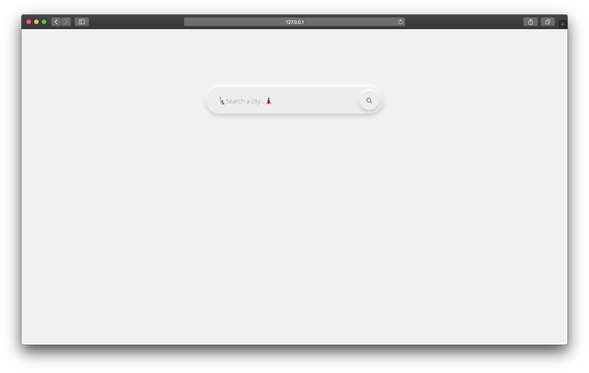
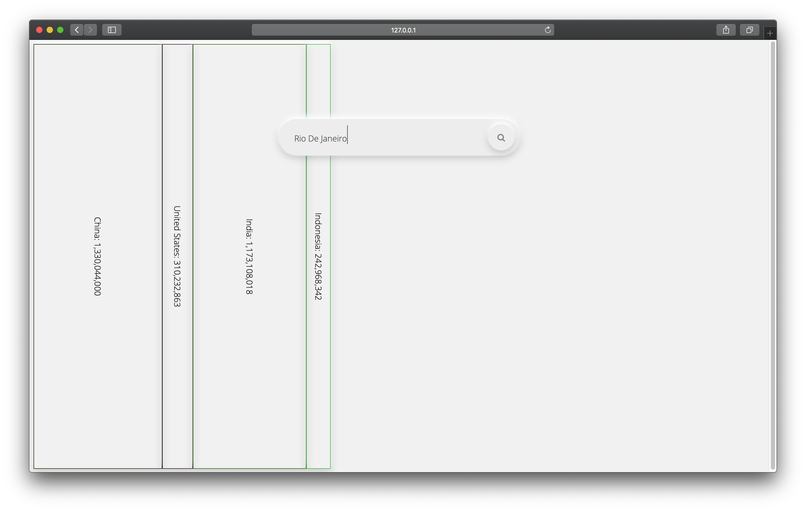
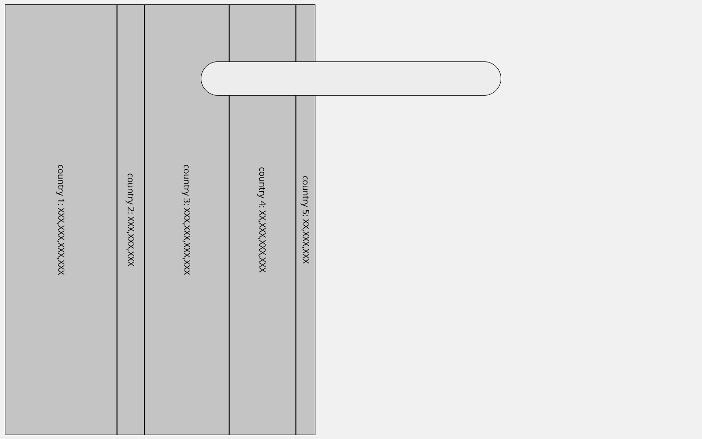
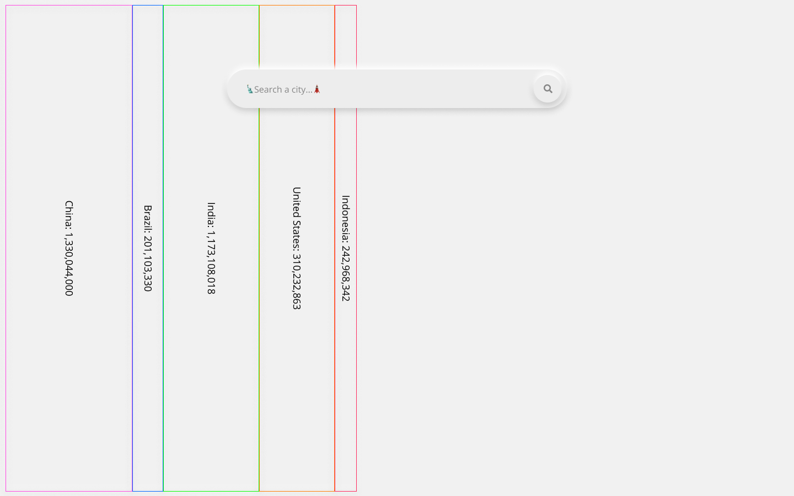
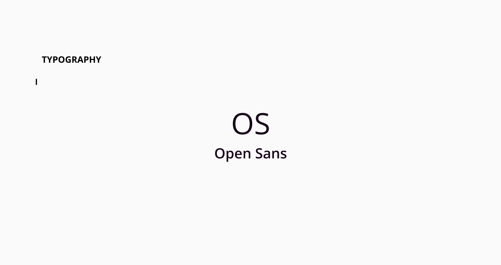

# Populate

This is the week 2 assignment for the ITP class Dynamic Web Development.




[Live Demo on Glitch](https://jasontsemf-populate.glitch.me/)

## Inspiration

I started by looking at the [Public APIs GitHub page](https://github.com/public-apis/public-apis#animals). I wanted to ensure that I will have the data I needed to build something related to the data itself. And finally settled with the [Teleport](https://developers.teleport.org/). The API does not require an `API key` which is easy to get started. Using this api I can obtain "quality of life" related data of a city or a country, like population, price level, life quality score in different aspects, etc.

Therefore I came up with the idea of visualizing the population data based on the real estate of one's laptop screen width. The more the popultaion of a country, the bigger the portion of the screen will be taken up by it's block.

## Design

The major UI element needed for this project is only a search bar and a search button. And I can reuse and leverage [Neumorphism](https://github.com/jasontsemf/Neumorphism) that I built for the first week's assignment.

[Project on Figma](https://www.figma.com/file/hH133ysVOccCANj3oOsD0G/Populate?node-id=0%3A1)

I got more familiar with Figma and I worked much faster this time. 


*Barebone wirefram that incorporates a simple searh bar*


*Neumorphic search bar with blocks representing different countries populations in several random colors*


*My favourite font from Google*

## Building the Website

### HTML and CSS

Learned from the last assignment, I use `display: flex` again for putting all the country population blocks into the same `row`.


The search bar is composed by the `<input>` and a `<button>`. In addition, I imported the `Font Awesome` library for search icon.

```HTML
<div class="search">
    <input type="text" id="city" autocomplete="off" placeholder="🗽Search a city...🗼">
    <div id="button"><i class="fa fa-search "></i></div>
</div>
```

Despite the similarity between the original `Neumorphic` sphere created before, the new classes color scheme is slightly tweaked for better visibility.

```CSS
.search {
    position: absolute;
    top: 20%;
    left: 50%;
    height: 50px;
    border-radius: 50px;
    padding: 10px;
    transform: translate(-50%, -20%);
    background-color: #ededed;
    box-shadow: 0px -6px 10px rgba(255, 255, 255, 1), 0px 4px 15px rgba(0, 0, 0, 0.2);
    z-index: 1;
}
```

Specifically for the vertically placed text inside the country block, it is placed vertically with the following CSS.

```CSS
.vertical {
    writing-mode: vertical-rl;
    text-orientation: mixed;
}
```

### Javascript

#### API call

Considering the structure of the APIs provided by Teleport, I have to made 3 API calls in total in order to get a country's pupolation.

***

/cities/ for getting city's id closet result to the query

/cities/{city-id}/ for getting country's id

/countries/{country_id} for getting country's population

***

After obtaining the number of population, I simply put the country's population into a ratio of it compared to the world's population, then append the `<div>` into the `wrapper`. A `Set()` object is also created to check if the country has already been added onto the DOM. `jQuery` is also used to make my development easier and less time consuming.

```JS
let countrySet = new Set();

function newBlock(country) {
    var c = "class =\"block\"";
    var factor = country.population / 7794798739;
    var newDiv = `<div ${c} style="width:calc(100vw*${factor})">
                    <span class="vertical">
                    ${country.name}: ${country.population.toLocaleString()}
                    </span>    
                </div>`;
    const r = Math.random()*255;
    const g = Math.random()*255;
    const b = Math.random()*255;

    if (!countrySet.has(country.name)) {
        $(newDiv).hide().appendTo(".wrapper").css("border", `solid 1px rgb(${r},${g},${b})`).fadeIn("slow");
        countrySet.add(country.name);
        $("#city").attr("placeholder", "🗽Search a city...🗼");
    } else {
        $("#city").attr("placeholder", "🚫Search something else");
    }
}
```

## Improvement

If the user is not typing a city's name into the search bar may result some unexpected result. For example, searching `united states` will show a `Brazil` block, as interestingly the API consider `São Paulo, São Paulo, Brazil` the result closest to `united states`. I think more checking can be done in order to validate if the user has searched a country's name instead of a city's name.

## Reference

[Teleport API](https://developers.teleport.org/)

[text-orientation](https://developer.mozilla.org/en-US/docs/Web/CSS/text-orientation)

[Disable HTML Form Input Autocomplete and Autofill](https://gist.github.com/niksumeiko/360164708c3b326bd1c8)

[How to print a number with commas as thousands separators in JavaScript
](https://stackoverflow.com/questions/2901102/how-to-print-a-number-with-commas-as-thousands-separators-in-javascript)

[Trigger a Button Click on Enter](https://www.w3schools.com/howto/howto_js_trigger_button_enter.asp)

[jQuery append fadeIn](https://stackoverflow.com/questions/978708/jquery-append-fadein)